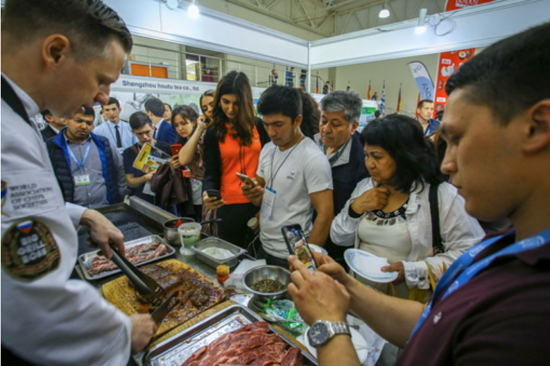

# 21st International Exhibition
# Food, Ingredients and Food Technologies

> Exhibiting at UzFood is a unique opportunity to present your products to a wide audience of professionals, find new partners and customers among representatives of retail chains and wholesale businesses.

## Link to the online version

This site was built using [GitHub Pages](https://oybekkayumov.github.io/module1-project/)

## Built With

- HTML
- CSS
- JavaScript

## Getting Started

to set this project up please run these commands:

`git clone https://github.com/OybekKayumov/module1-project.git`

`cd module1-project`

## 👤 Author

- GitHub: [@OybekKayumov](https://github.com/OybekKayumov)
- Twitter: [@KayumovOybek](https://twitter.com/KayumovOybek)
- LinkedIn: [Oybek Kayumov](https://www.linkedin.com/in/oybek-kayumov-54a8485b/)

## 🤝 Contributing

Contributions, issues, and feature requests are welcome!

Feel free to check the issues page.

# Show your support

Give a ⭐️ if you like this project!

## 📝 License

This project is [MIT](https://www.mit.org/) licensed.
